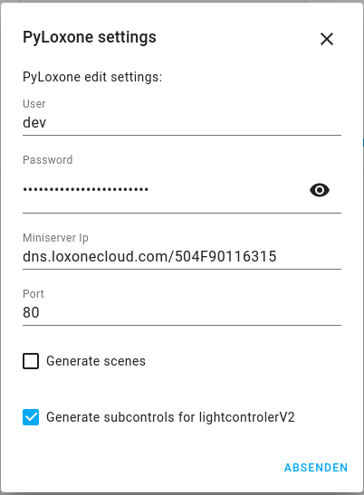

# PyLoxone
[](https://github.com/hacs/integration)

If you want to support my work on this binding you can buy me a coffee:

<a href="https://www.buymeacoffee.com/JoDehli" target="_blank"></a>


Home Assistant binding for Loxone. 

A special thanks to Pawel Pieczul from the great openhab2 house automation software. 
He really helped me a lot to with the new token based authentification. Thanks Pawel!!!

#### This release works for the version 0.103.0 and newer!!


## Config for the gen2 miniserver
If you have the gen2 miniserver you must use your loxonecloud address. You can find out your address in
the LoxoneConifg software. You need your serial number. You also need to forward your ports correctly. 
Here is an example config:



## Manual installation
1. Download the zip file and extract all files.
2. Copy the ***custom_components*** and ***www*** folder in the same folder where your configuration.yaml is located
3. Restart Home-Assitant
4. Go to Configuration -> Integrations and search for Pyloxone
5. Add the Intgration and fill out all required fields
6. Restart Home-Assitant

## Hacs installation
1. Install hacs to your homeassistant installation. See https://hacs.xyz/docs/installation/manual
2. Add this repository to hacs: https://github.com/JoDehli/PyLoxone
3. Install the PyLoxone binding 
4. Restart Home-Assitant
5. Go to Configuration -> Integrations and search for Pyloxone
6. Add the Intgration and fill out all required fields
7. Restart Home-Assitant


## Configuration over yaml (deprecated)
Not supported anymore.

## Websocket direct command
Send command direct to the loxone for example a pulse event to a switch:

```yaml
{
"uuid":"0f1e0b31-0179-7f77-ffff403fb0c34b9e",
"value":"pulse"
}
```

## Supported Loxone Entites
- InfoOnlyAnalog and InfoOnlyDigital
- Switch, TimedSwitch and Pushbutton
- Jalousie, Window and Gate
- Intercom
- LightControllerV2
- Alarm
- Fan (thanks for the implementation [cabeljunky](https://github.com/cabeljunky) )
- RoomControllerV2 (thanks for the implementation [ztamas83](https://github.com/ztamas83) )

### If your Device is not supported
You can integrate nearly every Loxone Entity in your Home-Assistent System by adding a custom sensor to your yaml file. 

### Example 1 with a RoomComfortTemperature
Here is a example of a sensor which is displaying the comfort temperature of a room controller v2:
```yaml
sensor:
  - name: RoomComfortTemperature
    platform: loxone
    uuidAction: "15beed5b-01ab-d81d-ffff2b06d5b9c660"
    unit_of_measurement: "°C"
    device_class: "temperature"    # Use device classes from homeassitant for example temperature, humidity, voltage   
    state_class: "total"           # measurement, total or total_increasing see https://developers.home-assistant.io/docs/core/entity/sensor/#long-term-statistics
```
In this example a sensor with the name roomcomforttemperature (sensor.roomcomforttemperature) is created. The sensor is listening to all events from the loxone system with the specified uuid ([How do you get the uuid?](https://github.com/JoDehli/PyLoxone/tree/dev#how-do-you-get-the-uuid)).

You can also send any websocket to a loxone entity for example to increase and decrease the temperature of a room controller v2. Here is a script that raises and lowers the temperature in 0.5 °C steps:

```yaml
script:
  tempup:
    alias: TempUp
    mode: single
    sequence:
    - data_template:
        uuid: "15beed5b-01ab-d81f-ffff403fb0c34b9e" 
        value: "setComfortTemperature/{{ states('sensor.roomcomforttemperature')|float+0.5}}"
      service: loxone.event_websocket_command
  tempdown:
    alias: TempDown
    mode: single
    sequence:
    - data_template:
        uuid: "15beed5b-01ab-d81f-ffff403fb0c34b9e"
        value: "setComfortTemperature/{{ states('sensor.roomcomforttemperature')|float-0.5}}"
      service: loxone.event_websocket_command
```

### Example 2 with a UpDownAnalog

- First get the uuidAction as described above for example. Let's assume your uuidAction for the UpDownAnalog is 152ecfaa-03ac-f715-ffff403fb0c34b9e.
- Create a Sensor do display the current value of the UpDownAnalog like this:
```yaml
sensor:
  - name: "Up and Down Sensor"
    platform: loxone
    uuidAction: "152ecfaa-03ac-f715-ffff403fb0c34b9e"
    unit_of_measurement: ""
```
- Create a script for incrementing up and down like this:
```yaml
down:
  alias: Down
  mode: single
  sequence:
  - data_template:
      uuid: "152ecfaa-03ac-f715-ffff403fb0c34b9e"
      value: "{{ states('sensor.up_and_down_sensor')|float-1}}"
    service: loxone.event_websocket_command

up:
  alias: Up
  mode: single
  sequence:
  - data_template:
      uuid: "152ecfaa-03ac-f715-ffff403fb0c34b9e"
      value: "{{ states('sensor.up_and_down_sensor')|float+1}}"
    service: loxone.event_websocket_command
```

The commands for each entity can be found in the structure file. You can download it from the [Loxone Hompage](https://www.loxone.com/dede/kb/api/).

 ### How do you get the uuid?
You can get the uuid from your loxone setup by visit the folowing site with your prefered browser:

```
http://{ip-address-of-your-loxone}:{port}/data/LoxAPP3.json

{ip-address-of-your-loxone} --> replace with the ip of your loxone 

{port} --> replace with your port (default: 80)
```
After entering your username and password you will see your LoxApp3.json. You can paste it in your prefered text editor and save it as a json file. In this file you can find all your uuid ids for all your devices.  


Here is a example of a Room Controller V2: 
```json
        "15beed5b-01ab-d81f-ffff403fb0c34b9e": {
            "name": "Intelligente Raumregelung",
            "type": "IRoomControllerV2",
            "uuidAction": "15beed5b-01ab-d81f-ffff403fb0c34b9e",
            "room": "13efd3e5-019d-8ad2-ffff403fb0c34b9e",
            "cat": "152c22de-0338-94b5-ffff403fb0c34b9e",
            "defaultRating": 2,
            "isFavorite": false,
            "isSecured": false,
            "details": {
                "timerModes": [
                    {
                        "name": "Anwesend",
                        "description": "Komfortbetrieb",
                        "id": 1
                    },
                    {
                        "name": "Abwesend",
                        "description": "Sparbetrieb",
                        "id": 0
                    },
                    {
                        "name": "Aus",
                        "description": "Geb\u00e4udeschutz",
                        "id": 2
                    }
                ],
                "format": "%.1f\u00b0",
                "connectedInputs": 0
            },
            "states": {
                "tempActual": "15beed5b-01ab-d7f7-ffff2b06d5b9c660",
                "tempTarget": "15beed5b-01ab-d81d-ffff2b06d5b9c660",
                "comfortTemperature": "15beed5b-01ab-d7ff-ffff2b06d5b9c660",
                "comfortTolerance": "15beed5b-01ab-d800-ffff2b06d5b9c660",
                "absentMinOffset": "15beed5b-01ab-d801-ffff2b06d5b9c660",
                "absentMaxOffset": "15beed5b-01ab-d802-ffff2b06d5b9c660",
                "frostProtectTemperature": "15beed5b-01ab-d803-ffff2b06d5b9c660",
                "heatProtectTemperature": "15beed5b-01ab-d804-ffff2b06d5b9c660",
                "activeMode": "15beed5b-01ab-d7f1-ffff2b06d5b9c660",
                "comfortTemperatureOffset": "15beed5b-01ab-d7ec-ffff2b06d5b9c660",
                "overrideEntries": "15beed5b-01ab-d7ed-ffff2b06d5b9c660",
                "prepareState": "15beed5b-01ab-d7ee-ffff2b06d5b9c660",
                "useOutdoor": "15beed5b-01ab-d7ef-ffff2b06d5b9c660",
                "operatingMode": "15beed5b-01ab-d7f2-ffff2b06d5b9c660",
                "overrideReason": "15beed5b-01ab-d7f4-ffff2b06d5b9c660",
                "openWindow": "15beed5b-01ab-d7f8-ffff2b06d5b9c660",
                "modeList": "15beed5b-01ab-d7f3-ffff2b06d5b9c660"
            },
            "subControls": {
                "15beed5b-01ab-d7eb-ffff2b06d5b9c660": {
                    "name": "Heating and Cooling",
                    "type": "IRCV2Daytimer",
                    "uuidAction": "15beed5b-01ab-d7eb-ffff2b06d5b9c660",
                    "defaultRating": 0,
                    "isFavorite": false,
                    "isSecured": false,
                    "details": {
                        "analog": true,
                        "format": "%.1f\u00b0"
                    },
                    "states": {
                        "entriesAndDefaultValue": "15beed5b-01ab-d7eb-ffff2b06d5b9c660",
                        "mode": "15beed5b-01ab-d81e-ffff2b06d5b9c660",
                        "modeList": "15beed5b-01ab-d7f3-ffff2b06d5b9c660",
                        "value": "15beed5b-01ab-d7f1-ffff2b06d5b9c660"
                    }
                }
            }
        },
```


