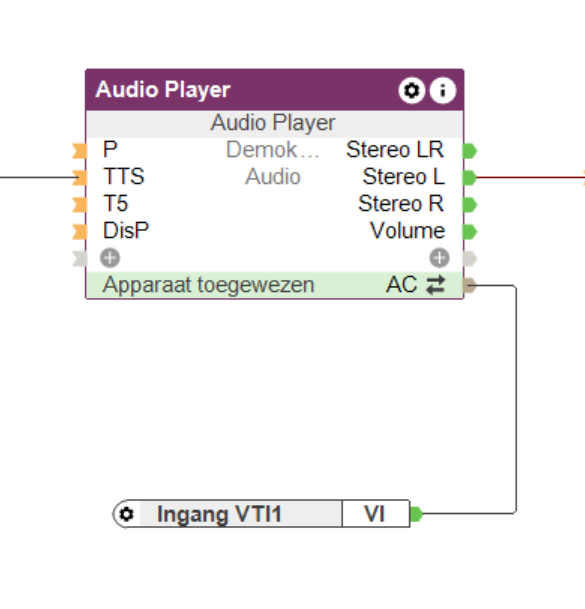

# PyLoxone
[](https://github.com/hacs/integration)

If you want to support my work on this binding you can buy me a coffee:

<a href="https://www.buymeacoffee.com/JoDehli" target="_blank"></a>


Home Assistant binding for Loxone. 

A special thanks to Pawel Pieczul from the great openhab2 house automation software. 
He really helped me a lot to with the new token based authentification. Thanks Pawel!!!

#### This release works for the version 2024.1.0 and newer!!


## Config for the gen2 miniserver
If you have the gen2 miniserver you must connect via local access. All cloud connections are not working at the moment.

## Manual installation
1. Download the zip file and extract all files.
2. Copy the ***custom_components*** and ***www*** folder in the same folder where your configuration.yaml is located
3. Restart Home-Assitant
4. Go to Configuration -> Integrations and search for Pyloxone
5. Add the Intgration and fill out all required fields
6. Restart Home-Assitant

## Hacs installation
1. Install hacs to your homeassistant installation. See https://hacs.xyz/docs/installation/manual
2. Add this repository to hacs: https://github.com/JoDehli/PyLoxone
3. Install the PyLoxone binding 
4. Restart Home-Assitant
5. Go to Configuration -> Integrations and search for Pyloxone
6. Add the Intgration and fill out all required fields
7. Restart Home-Assitant

## Supported Loxone Entities
Currently, this integration supports the following Loxone entities by mapping them to Home Assistant entities.
If you encounter a Loxone entity that is currently not supported, you can post a feature request so it can be looked into.

- InfoOnlyAnalog and InfoOnlyDigital
- Switch, TimedSwitch and Pushbutton
- Jalousie, Window and Gate
- Intercom
- LightControllerV2
- Alarm
- Fan
- RoomControllerV2
- AudioZoneV2
- Slider
- TextInput

## Known Limitations

- Pushbuttons are stateless. They can not be used to reliably trigger automations. Use a Switch as a workaround and turn it off again in the Automation or in Loxone itself. 

## Log Configuration
Use the following settings if you paste a log into a issue:

```yaml
logger:
  default: warning
  logs:
    homeassistant: warning
    homeassistant.helpers: warning
    custom_components.loxone: debug
    custom_components.loxone.api: debug
```

## Recorder Configuration
A Loxone system generates a few thousand events per day. These events are recorded in your homeassistant and the database file can grow a lot per day. It is recommended to exclude loxone events from the recorder using the following settings:

```yaml
recorder:
  exclude:
    event_types:
      - loxone_event
```

## Websocket direct command service
If you want to send data directly to Loxone inputs or blocks that are not (yet) supported, you can use this service to send a command:

```yaml
{
"uuid":"0f1e0b31-0179-7f77-ffff403fb0c34b9e",
"value":"pulse"
}
```
You can choose to send the commands using the UUID or the entity-name. See Developer Tools -> Services for more details.
Websocket direct commands enable you to, for example, send data captured by devices integrated in Home Assistant immediately to the miniserver using a VI on the miniserver.

## Some examples

### Using a TextInput to controle a block's API Connector

The TextInput Virtual Input in the Miniserver enables some neat advanced applications.  
The Audioserver for example, has limited API-support. If you want to switch presets from Home Assistant, this is not possible using the traditional Audio Player API interface.

A neat way around this, is by adressing the Audio Player block's API Connector using a VTI (Virtual Text Input). This enables all of the block's functionality in Home Assistant.

First, create a VTI and connect it to the block's API Connector.



Second, send anything you want to this VTI from Home Assistant. In this use case, we want the Audio Player to switch to preset 4:

```
service: loxone.event_websocket_command
data:
  value: SET(Ap;Fav;4)
  device: text.ingang_vti1
```
You can even directly address the Audio Player's TTS engine.
```
service: loxone.event_websocket_command
data:
  device: text.ingang_vti1
  value: SET(AP;TTS;Woop-woop, that's the sound of da police)

```
### Using a Slider to send data from Home Assistant to the Loxone Miniserver

The Miniserver connects to/interfaces with a wide range of third party devices and services. However, support is quite limited in comparison to Home Assistant.  
If you take the DSMR P1 digital meter interface for example. This (serial) interface is supported on a wide range of platforms, but not on the Miniserver.  
A workaround could be creating a VI on the Miniserver and configuring it as a Slider. This VI will then appear in this integration as a Number entity to which you can send any numerical value.  
Any change in the sensor value in Home Assistant should trigger an automation that sets the new value to the entity in the Loxone integration.

## Advanced usage: what to do if your device is not supported
You can integrate nearly every Loxone Entity in your Home Assistant system by adding a custom sensor to your yaml file. 

### Example 1 with a RoomComfortTemperature
Here is a example of a sensor which is displaying the comfort temperature of a room controller v2:
```yaml
sensor:
  - name: RoomComfortTemperature
    platform: loxone
    uuidAction: "15beed5b-01ab-d81d-ffff2b06d5b9c660"
    unit_of_measurement: "°C"
    device_class: "temperature"    # Use device classes from homeassitant for example temperature, humidity, voltage   
    state_class: "total"           # measurement, total or total_increasing see https://developers.home-assistant.io/docs/core/entity/sensor/#long-term-statistics
```
In this example a sensor with the name roomcomforttemperature (sensor.roomcomforttemperature) is created. The sensor is listening to all events from the loxone system with the specified uuid ([How do you get the uuid?](https://github.com/JoDehli/PyLoxone?tab=readme-ov-file#how-do-you-get-the-uuid)).

You can also send any websocket to a loxone entity for example to increase and decrease the temperature of a room controller v2. Here is a script that raises and lowers the temperature in 0.5 °C steps:

```yaml
script:
  tempup:
    alias: TempUp
    mode: single
    sequence:
    - data_template:
        uuid: "15beed5b-01ab-d81f-ffff403fb0c34b9e" 
        value: "setComfortTemperature/{{ states('sensor.roomcomforttemperature')|float+0.5}}"
      service: loxone.event_websocket_command
  tempdown:
    alias: TempDown
    mode: single
    sequence:
    - data_template:
        uuid: "15beed5b-01ab-d81f-ffff403fb0c34b9e"
        value: "setComfortTemperature/{{ states('sensor.roomcomforttemperature')|float-0.5}}"
      service: loxone.event_websocket_command
```

### Example 2 with a UpDownAnalog

- First get the uuidAction as described above for example. Let's assume your uuidAction for the UpDownAnalog is 152ecfaa-03ac-f715-ffff403fb0c34b9e.
- Create a Sensor do display the current value of the UpDownAnalog like this:
```yaml
sensor:
  - name: "Up and Down Sensor"
    platform: loxone
    uuidAction: "152ecfaa-03ac-f715-ffff403fb0c34b9e"
    unit_of_measurement: ""
```
- Create a script for incrementing up and down like this:
```yaml
down:
  alias: Down
  mode: single
  sequence:
  - data_template:
      uuid: "152ecfaa-03ac-f715-ffff403fb0c34b9e"
      value: "{{ states('sensor.up_and_down_sensor')|float-1}}"
    service: loxone.event_websocket_command

up:
  alias: Up
  mode: single
  sequence:
  - data_template:
      uuid: "152ecfaa-03ac-f715-ffff403fb0c34b9e"
      value: "{{ states('sensor.up_and_down_sensor')|float+1}}"
    service: loxone.event_websocket_command
```

The commands for each entity can be found in the structure file. You can download it from the [Loxone Hompage](https://www.loxone.com/dede/kb/api/).

## How do you get the uuid?

If you need the UUID of an entity to use it in a service call or to manually add it to Home Assistant, you can get it from your Loxone setup by visit the folowing site with your prefered browser:

```
http://{ip-address-of-your-loxone}:{port}/data/LoxAPP3.json

{ip-address-of-your-loxone} --> replace with the ip of your loxone 

{port} --> replace with your port (default: 80)
```
After entering your username and password you will see your LoxApp3.json. You can paste it in your prefered JSON editor/viewer (eg. https://jsonformatter.org/). 
In this file you can find all your uuid ids for all your devices.  


Here is a example of a Room Controller V2: 
```json
        "15beed5b-01ab-d81f-ffff403fb0c34b9e": {
            "name": "Intelligente Raumregelung",
            "type": "IRoomControllerV2",
            "uuidAction": "15beed5b-01ab-d81f-ffff403fb0c34b9e",
            "room": "13efd3e5-019d-8ad2-ffff403fb0c34b9e",
            "cat": "152c22de-0338-94b5-ffff403fb0c34b9e",
            "defaultRating": 2,
            "isFavorite": false,
            "isSecured": false,
            "details": {
                "timerModes": [
                    {
                        "name": "Anwesend",
                        "description": "Komfortbetrieb",
                        "id": 1
                    },
                    {
                        "name": "Abwesend",
                        "description": "Sparbetrieb",
                        "id": 0
                    },
                    {
                        "name": "Aus",
                        "description": "Geb\u00e4udeschutz",
                        "id": 2
                    }
                ],
                "format": "%.1f\u00b0",
                "connectedInputs": 0
            },
            "states": {
                "tempActual": "15beed5b-01ab-d7f7-ffff2b06d5b9c660",
                "tempTarget": "15beed5b-01ab-d81d-ffff2b06d5b9c660",
                "comfortTemperature": "15beed5b-01ab-d7ff-ffff2b06d5b9c660",
                "comfortTolerance": "15beed5b-01ab-d800-ffff2b06d5b9c660",
                "absentMinOffset": "15beed5b-01ab-d801-ffff2b06d5b9c660",
                "absentMaxOffset": "15beed5b-01ab-d802-ffff2b06d5b9c660",
                "frostProtectTemperature": "15beed5b-01ab-d803-ffff2b06d5b9c660",
                "heatProtectTemperature": "15beed5b-01ab-d804-ffff2b06d5b9c660",
                "activeMode": "15beed5b-01ab-d7f1-ffff2b06d5b9c660",
                "comfortTemperatureOffset": "15beed5b-01ab-d7ec-ffff2b06d5b9c660",
                "overrideEntries": "15beed5b-01ab-d7ed-ffff2b06d5b9c660",
                "prepareState": "15beed5b-01ab-d7ee-ffff2b06d5b9c660",
                "useOutdoor": "15beed5b-01ab-d7ef-ffff2b06d5b9c660",
                "operatingMode": "15beed5b-01ab-d7f2-ffff2b06d5b9c660",
                "overrideReason": "15beed5b-01ab-d7f4-ffff2b06d5b9c660",
                "openWindow": "15beed5b-01ab-d7f8-ffff2b06d5b9c660",
                "modeList": "15beed5b-01ab-d7f3-ffff2b06d5b9c660"
            },
            "subControls": {
                "15beed5b-01ab-d7eb-ffff2b06d5b9c660": {
                    "name": "Heating and Cooling",
                    "type": "IRCV2Daytimer",
                    "uuidAction": "15beed5b-01ab-d7eb-ffff2b06d5b9c660",
                    "defaultRating": 0,
                    "isFavorite": false,
                    "isSecured": false,
                    "details": {
                        "analog": true,
                        "format": "%.1f\u00b0"
                    },
                    "states": {
                        "entriesAndDefaultValue": "15beed5b-01ab-d7eb-ffff2b06d5b9c660",
                        "mode": "15beed5b-01ab-d81e-ffff2b06d5b9c660",
                        "modeList": "15beed5b-01ab-d7f3-ffff2b06d5b9c660",
                        "value": "15beed5b-01ab-d7f1-ffff2b06d5b9c660"
                    }
                }
            }
        },
```


