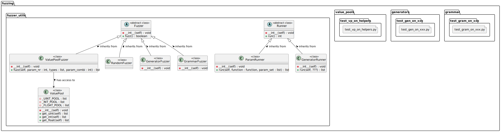

# Fuzzing
## What is Fuzzing
Fuzzing, or fuzz testing, is a software testing technique used to find vulnerabilities and bugs by inputting large amounts of random data, called "fuzz," into a program. 
The goal is to induce unexpected behavior, crashes, or memory leaks, thereby revealing security issues and flaws that might not be detected through traditional testing methods. 
By systematically feeding malformed or semi-random data to the software, fuzzing helps developers identify and fix critical vulnerabilities, enhancing the overall robustness and security of the application.

## Why are we fuzzing?
We are 5 students, and we have to fuzz an open source project for a grade bonus. 
So here we are!

## Start to fuzz
### Setup
1. create a virtual environment:

You can create the virtual environment in the project's root directory (recommended) or any other directory of your choice.
```shell
python -m venv venv
```
2. activate the virtual environment:

Windows
```shell
.\venv\Scripts\activate
```

Linux and macOS
```shell
source venv/bin/activate
```

3.  install the following packages:
```shell
pip install pytest
pip install pytest-timeout
pip install homeassistant
pip install numpy
```
4. you maybe have to tell python were to find the `PyLoxone` project 

Windows
- Go to the Windows menu and search for "Environment Variables".
- Select “Advanced system settings”.
- In the “System Properties” window, click the “Environment Variables” button.
- Click the “New” button in the top half of the dialog, to make a new user variable.
- Name the variable PYTHONPATH and set its value to the path of your code directory. Click "OK" and "OK" again to save.

Linux and macOS
```shell
export PYTHONPATH=$PYTHONPATH:/path/to/PyLoxone
```
### Run
- start the execution in the root of the repo
```shell
cd /path/to/PyLoxone
```
- run `pytest`
```shell
pytest
```
- if you only want to run a single test file, you can enter the path to the file:
```shell
pytest custom_components/test/path/to/test_file.py
```

## Fuzzer layout (UML)


# TODO
## Random testing 
> - Assigned to:
> - Branch: `fuzzing/random_testing`
- [ ] Implement a `RandomFuzzer`.
  - The return value should be identical to the `fuzz()` function of the `ValuePoolFuzzer` class so that the `ParamRunner` can be used.

## Value pools 
> - Assigned to: @jonathanheitzmann
> - Branch: `fuzzing/valuepool`
- [ ] Bug on param combi
- [ ] Update `ValuePoolFuzzer` class.
  - [ ] Add return types to function head
  - [ ] Update UML
- [ ] The parameter `param_nr` is superfluous and is not required in the function `fuzz()` of the `ValuePoolFuzzer` class. The number of parameters is already determined by the length of list `types`.
- [ ] The value pools contain no no neutral element like `None` or `NaN`. 
- [ ] To avoid duplication in the code, value pools should "inherit" from each other in some way.  For example, "_INT" also takes all values from "_UINT" (identical to Balista).

## Generators
> - Assigned to: @dsiev
> - Branch: `fuzzing/valuepool`
- Implement the generators.
  - [ ] Update UML
  - [ ] Get code running
  - [ ] Create test cases
  - [ ] Think about CSV variant 

## Input grammars
> - Assigned to: @JKortmann
> - Branch: `fuzzing/grammars`
- Implement the grammars.
  - [ ] Add general function description for docstring.
  - [ ] Update and check UML
  - Should we put the grammars in a separate `GrammarPool` class?
  - [ ] Create Testcases
    - [ ] Is it possible to use `ParamRunner`? Are updates on the `ParamRunner` needed?
    - What does a test case and/or a runner look like now? 
    - How do we deal with this if the function under test requires an `int` (e.g. from the `ValuePoolFuzzer`) and a `str` from the `GrammarFuzzer`?
  - [ ] Implementation of three-phase derivation (or random for the `MutationalFuzzer`)
  - [ ] Implementation of probabilistic derivation

## Mutational 
### black-box
> - Assigned to: @ThorbenCarl
> - Branch: `fuzzing/mutational_black_box`
- Implement the mutational fuzzing (black-box).
  - [x] Implement `fuzz()` function
  - [x] Implement fuzzer function for string functions
  - [x] Implement fuzzer function for int and float functions
  - [ ] Add comments
  - [ ] Create test cases for `helpers.py`
  - [x] Include grammars into test-cases
  - [ ] How to implement seed store? Recognize different errors.
> Notes:
> - The seed for a number is only used to recognise whether it is int or float, it does not really have any effect on the course of the fuzzer.
> - For `float` `+inf` and `-inf` are not tested.

### grey-box
> - Assigned to: @hoegma
> - Branch: `fuzzing/mutational_grey_box`
- [ ] Implement the mutational fuzzing (grey-box).
  - [ ] Present concept
  - [ ] Update UML

### white-box
> - Assigned to: --
> - Branch: `fuzzing/mutational_white_box`

## Search based
> - Assigned to: @jonathanheitzmann
> - Branch: `fuzzing/search_based`

# Vulnerabilities found
## `helpers.py`
### `map_range()`
- A possible 0 division is not checked or intercepted.